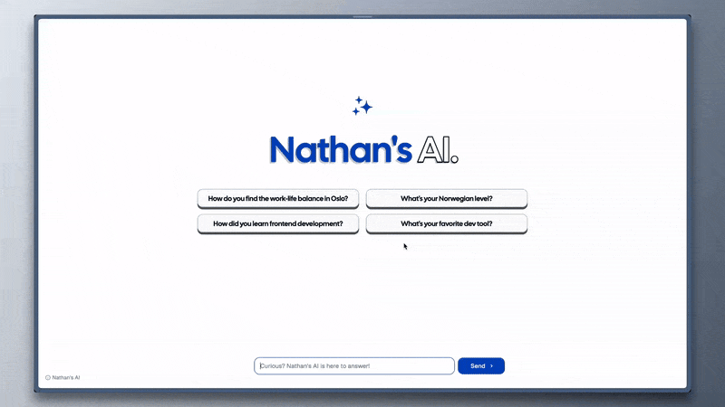

# Nathan's AI



Nathan's AI is a unique twist on the traditional portfolio. Instead of scrolling through pages of information, visitors can simply ask questions to learn about my career, skills, projects, and experiences. Built with Next.js, Tailwind CSS, and Vercel’s AI SDK, this chatbot acts as an interactive resume, letting you explore my journey in a conversational way.

The chatbot is designed to be simple and user-friendly. You can ask about my tech stack, past projects, where I studied, or anything else you'd find on a typical portfolio – and Nathan's AI will respond based on what it knows about me. It even has a friendly message for when you hit the rate limit, to keep things light-hearted.

This project showcases my skills in frontend development and my passion for creating engaging user experiences. It’s my portfolio, reimagined as a conversation.

## Tech Stack

- [Next.js](https://nextjs.org/)
- [TypeScript](https://www.typescriptlang.org/)
- [Tailwindcss](https://tailwindcss.com/)
- [shadcn/ui](https://ui.shadcn.com/)
- [Vercel AI SDK](https://sdk.vercel.ai/docs/introduction)
- [@upstash/ratelimit](https://upstash.com/docs/oss/sdks/ts/ratelimit/overview)
- [framer-motion](https://www.framer.com/motion/)
- [Bun](https://bun.sh)

This project uses the following services:

- [Anthropic Claude](https://www.anthropic.com/): AI API
- [Sentry](https://sentry.io/welcome/): Error tracking
- [Vercel](https://vercel.com/home): Hosting platform
- [Vercel kv](https://vercel.com/docs/storage/vercel-kv): Redis database (for rate limiting)
- [Vercel postgres](https://vercel.com/docs/storage/vercel-postgres): Postgres database (for saving conversations)

## Sources of Inspiration

- Empty Screen: [Cal.com](https://cal.com/)
- Messages animation: [Build UI](https://buildui.com/recipes/animated-list)
- Title animation: [@jh3yy](https://x.com/jh3yy/status/1849062440773820747)
- Themes: [ui/jln](https://ui.jln.dev/)
- Themes picker: [shadcn/ui](https://ui.shadcn.com/themes)

## Local Installation

- Clone the repository:

```bash
https://github.com/NathanBrodin/Chat.git
```

- Navigate to the project folder:

```bash
cd Chat
```

- Install packages using [Bun](https://bun.sh/docs/installation):

```bash
bun install
```

- Set up environment variables:

On macOS/Linux:

```bash
cp .env.example .env.local
```

On Windows:

```powershell
Copy-Item .env.example .env.local

```

- Get your Anthropic api key and paste it in `.env.local`.

- Create a kv database on [Vercel](https://vercel.com/storage/kv) and paste environment variables it in `.env.local`.

- Create a postgres database on [Vercel](https://vercel.com/storage/postgres) so you can save the conversations.

- Run the dev server:

```bash
bun run dev
```

That's it, you are all set!

## Deployment

This project is deployed on Vercel. Click the button below to deploy the chat in seconds!

[](https://vercel.com/new/clone?repository-url=https%3A%2F%2Fgithub.com%2Fnathanbrodin%2Fchat&env=ANTHROPIC_API_KEY,KV_URL,KV_REST_API_URL,KV_REST_API_TOKEN,KV_REST_API_READ_ONLY_TOKEN&demo-title=Nathan's%20AI&demo-description=Curious%20about%20Nathan%20Brodin%3F%20Ask%20his%20AI%20anything!&demo-url=https%3A%2F%2Fchat.brodin.dev)
